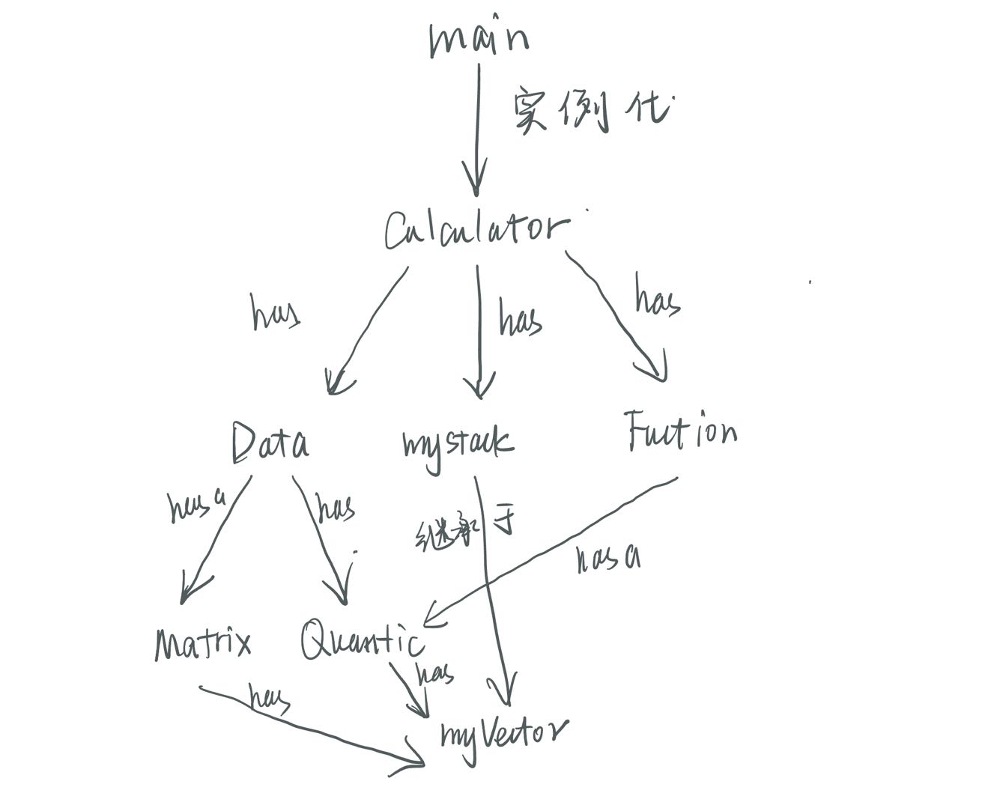

# 实验报告

[TOC]

## 计算器整体框架设计

### 类与类之间的关系

### 设计思路

- 此计算器对于表达式的计算参照数值表达式的计算，以利用栈对中缀表达式计算算法为整体框架，对计算的对象加入矩阵与一元多项式。

- 对于函数的定义与计算，每一个函数封装对应的多项式与它引用的函数名，再通过哈希表有函数名找到对应的函数，通过递归计算来计算函数值

  

## 类功能的说明

### myVector类：

仿照STL vector类建立自己的向量，定义了扩容，push_back，sort等常用接口。

### myStack类：

继承于myVector类，定义了push，pop，top等常用接口。

### Data类：

表达式计算的基本对象，封装了Matrix对象、Quantic对象、与double数据类型，并以type值代表Data中有效数据的类型。

### Matrix类：

矩阵类，定义myVector<myVector<double>> 作为矩阵数据域，重载了+, -, *, /等运算符，封装了矩阵之间的运算、行列式的求值、特征值的求解等成员函数。其中，行列式的求解采用递归地方式依次降阶，特征值则采用模拟退火算法进行随机搜索。

### Quantic类:

一元多项式类，定义string类型name作为变量名，myVector<double>类型parameter作为数据域，其中下标对应多项式的阶数，parameter[i]对应系数。类中重载了+, -, * , &(微分)，~(积分)等运算符。

### Fuction类：

函数处理类，每一个函数包含一个多项式与它调用的其他已经定义的函数。类中封装了函数定义的方法与函数求值的方法，在函数体内调用其他函数支持#f(#)的形式，其中#为多项式